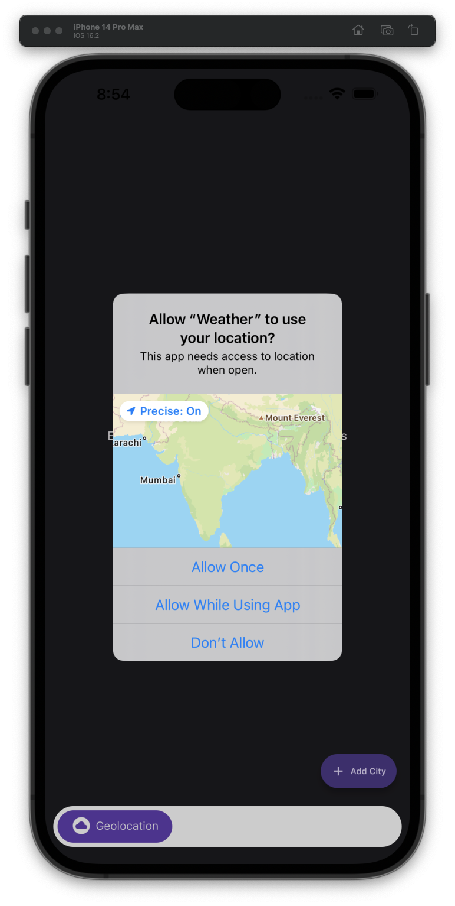
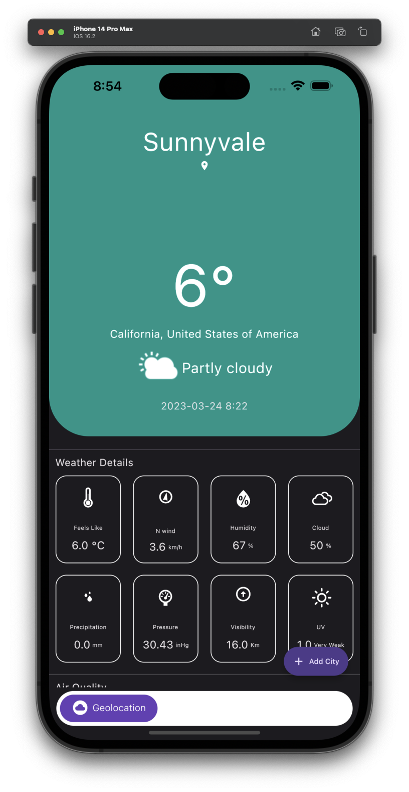
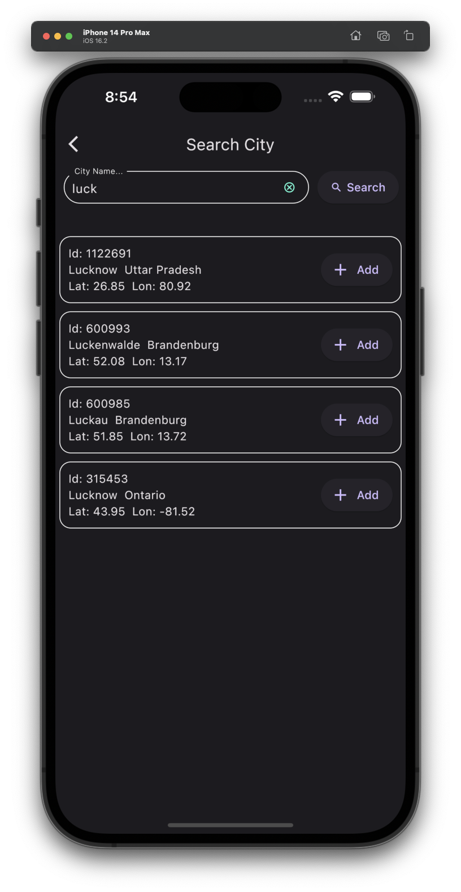
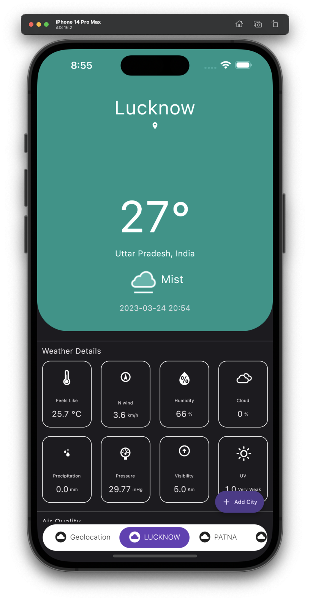
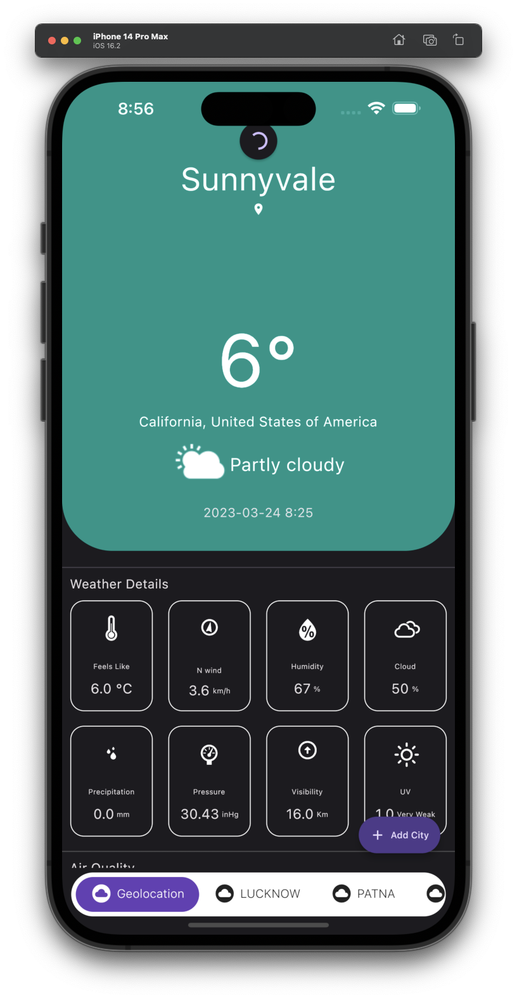
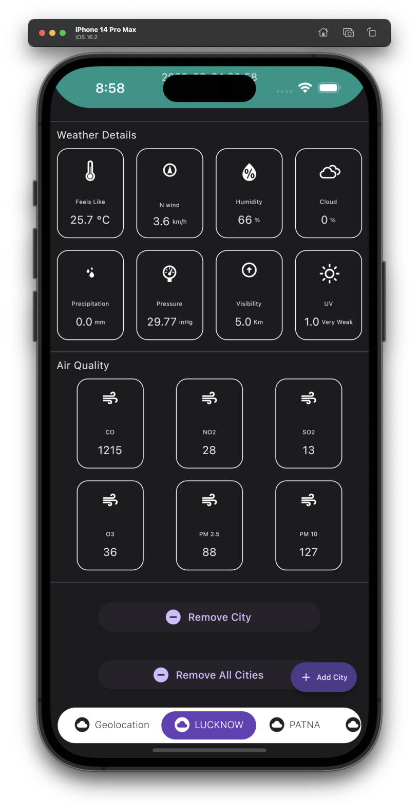

# weather
A weather app using Flutter with Provider State Management and WeatherApi.
- There is a class named WeatherBook which extends a ChangeNotifier which manages a list of WeatherSearchItems.
- When you search the city (using weatherApi searchApi), you can add it to the list and as the list is modified notifyListeners() is called, it rebuilds the DefaultTabController which is child of Consumer \<WeatherBook> widget.
- One WeatherSearchItem is then passed to WeatherView widget which calls the WeatherApi to get the Weather data and then widgets are rendered inside a FutureBuilder.
- And this way i am adding new weather tabs dynamically and the weather tabs are unique.
- Also it has a default weather tab which gets the geolocation weather, which here iOS simulator is just emulating Apple California.
- Used weather_icons which has wind_icons directing to the particular direction according to the wind data provided.

=> packages used - http, provider, geolocator, weather_icons

  <h1></h1>

<table>
  <tr>
    <td align="center">Location Permission</td>
     <td align="center">Geolocation Weather</td>
     <td align="center">Search Cities</td>
  </tr>
  <tr>
    <td></td>
    <td></td>
    <td></td>
  </tr>
 </table>

 <table>
  <tr>
    <td align="center">Multiple Weather Tabs</td>
     <td align="center">Refresh Indicator</td>
     <td align="center">Remove City/ Cities except Geolocation</td>
  </tr>
  <tr>
    <td></td>
    <td></td>
    <td></td>
  </tr>
 </table>

A new Flutter project.

### ⚡️ My Social Medias

Twitter: [@Syed-Muhammad-Ali](https://twitter.com/Ali3530345)

LinkedIn: [@Syed-Muhammad-Ali](https://www.linkedin.com/in/syed-muhammad-ali-flutterdeveloper/)

GitHub: [@Syed-Muhammad-Ali](https://github.com/Syed-Muhammad-Ali)
